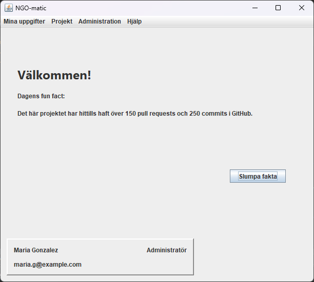

# IK100G-H2627H24-Java-Project
A system development project in Java. The first part of the course was to identify the needs of the an NGO and structure the data. The second part was to build the system that would solve their need of a project management system

<!--- Ett backslash \ efter namnet ger en radbrytning -->
We who built this solution:\
Andreas Galistel\
Fredrik Magnusson\
Märta Sjöblom\
Claudia Kourieh

## Project Management System for an NGO

A simple GUI that connects to a mockdatabase that was created using ChatGPT. 

